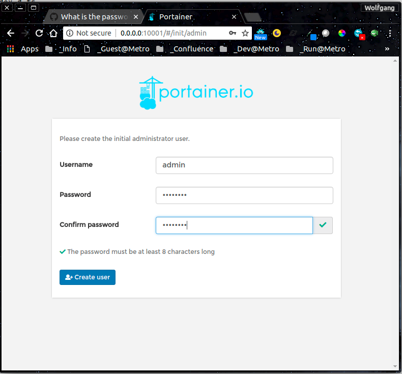
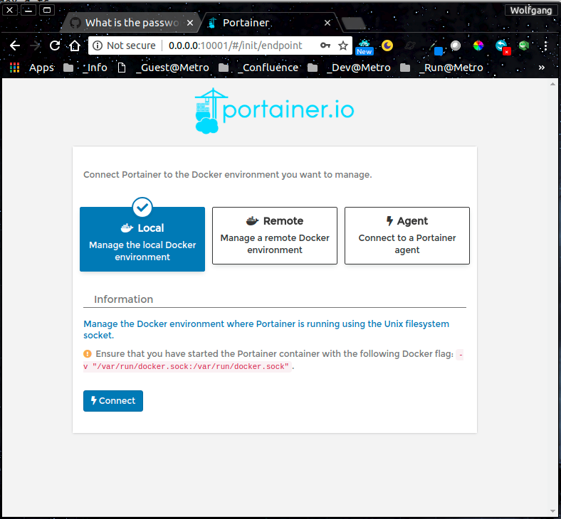
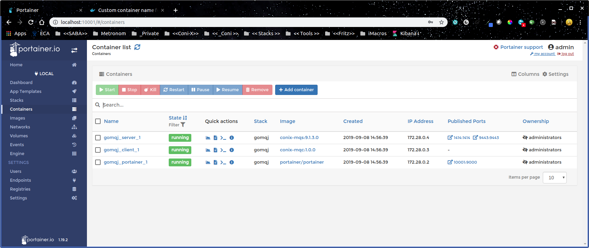

# **ConiX:** **`GoMq`** Read/Write from and to IBM-MQ 
# **Content**
- [Main Readme](./README.md)
- [About](#About)
- [Settings](#Settings)
- [Prerequisites](#Prerequisites)
- [Install](#Install)
- Uses
    - [Golang-Image](#Golang-Image)
- Pending
    - [None](#None)
- [Appendix](#Appendix)

- --
## About
This project is build to integrate GoLang into IBM-MQ-Usage
As starting-point this repos have been used
- [mq-golang](https://github.com/ibm-messaging/mq-golang) was used as a starting-point 
integration part

#### *SIDE-NOTE*&nbsp;: IBM-MQ-Rest
- [MQ messaging REST API tutorial](https://developer.ibm.com/messaging/learn-mq/mq-tutorials/ibm-mq-messaging-rest-api/)
- [Getting started with the messaging REST API](https://www.ibm.com/support/knowledgecenter/SSFKSJ_9.1.0/com.ibm.mq.dev.doc/q130950_.htm)
- Used on our MQS-Container (only Point 4. Replace the existing configuration file, mqwebuser.xml) [Basic configuration for the mqweb server](https://www.ibm.com/support/knowledgecenter/SSFKSJ_9.1.0/com.ibm.mq.con.doc/q132130_.htm)
- [Using token-based authentication with the REST API](https://www.ibm.com/support/knowledgecenter/SSFKSJ_9.1.0/com.ibm.mq.sec.doc/q128720_.htm)
## Prerequisites

| |What|Why| 
|-|---|---| 
| |Docker|as it is used for all your containers|
| |docker-compose|as we work only with comosed containers|
| |~~figlet~~|~~for Banners on scripting, in special for version-display~~|
| |~~NPM~~|~~for package.json and auto-increment version-tagging (from JavaScript)~~|

- --
## Settings

#### Important file in project-root-folder
| | File| Description |
|-|-|-|
| | ./_config.base_|  Definitions for all needed Project- and Container-Related Environment |
| | ./env.sh| environment-load script e.g. used by ./dc  |
| | ./dc| docker-compose commands including environment-load  |
| | ./docker-compose| docker-compose for all containers in this project  |
- Side Note
    - If you change the `CONIXMQM_MQMGR:QM1` in `./_config.base` to something different then `QM1`
    - the ` ./mq-test.sh` in `gomq_mqc_1` will no longer work. The TestCases are not designed, to use it correctly

#### Project-Folder-Organisation
| | Folder| Description |
|-|-|-|
| | mqs| IDM-MQ-Server  |
| | mqc| GoLang-MqClient|
| | mqw| Writer to Queue CONIX.LOCAL.QUEUE |
| | mqr| Reader to Queue CONIX.LOCAL.QUEUE |

#### Aviable Url's after starting up the cluster
| | Url | Description |
|-|-|-|
| | [Portainer](http://localhost:10001)|http://localhost:10001|Helper UI for Docker Container/Network aso|

#### Usage
- Testing go-progs
    - cd gopath/src/github.com/conix/mqio
    - go run mq-io.go -config ../../../../config/queue.config.producer.host.json -limit 5
    - go run mq-io.go -config ../../../../config/queue.config.producer.host.json -browse
    - go run mq-io.go -config ../../../../config/queue.config.producer.host.json -consume
- Enviroment are loaded from project-root/_conifg.base by project-root/env.sh
- All docker related stuff should be managed by project-root/dc-script, as this loads the environment
    - `./dc build mqc` and `./dc build mqs` or `./dc build` to build your container / containers
    - `./dc up` to startup your cluster **(takes 30sec to startup and config coinx-settings)**
    - `./dc down` to shutdown  your cluster
- MQS-Container is used to setup the Conix-Queue
    - The Startup-Script used is `./mqs/mq-entry.sh`
    - The Conix-Queue-Config is `./mqs/mq-setup.sh`
        - Alternative the Conix-Config can be done by `./mqs/11-dev.mqsc` 
        - copied to `/etc/mqm` in the container at build-time
            - BUT
                - this has not been tested !!!
                - the `./mqs/mq-setup.sh`-call has to be disabled in `./mqs/mq-entry.sh`
- Test conix-queue **(earliest >30sec after cluster is up)**
    - ` docker exec -it gomq_mqs_1 ./mq-test.sh` test golang-base within container
    - ` docker exec -it gomq_mqc_1 ./mq-io-test.sh` test golang-jms selfmade code within container
    - ` . ./project-root/mqs/mq-test.sh` test on your host
- Control your Docker Containers via [**Portainer**](http://0.0.0.0:10001) used on locale Build-Stack
    1. on first connect you have to define your admin password (this is never asked again, so take care)
        - ------------------- 1 -------------------
        - 
    2. choose following settings and contiune
        - ------------------- 2 -------------------
        - 
    - ...
    - This is how it looks like, if you applied a setup e.g. needed on eica-clearit-project
        - ------------------- 2 -------------------
        - 

#### Related Projects

These projects are related to or derived from this one. This is not a complete list
| | Repository                           | Description   |
|-|--------------------------------------|---------------|
| |[ibm-messaging/mq-metric-samples](https://github.com/ibm-messaging/mq-metric-samples)| Extracts metrics for use in Prometheus, Influx<br>JSON consumers etc.|
| |[ibm-messaging/mq-golang-jms20](https://github.com/ibm-messaging/mq-golang-jms20)   | JMS-style messaging interface for Go applications|
| |[ibm-messaging/mq-container](https://github.com/ibm-messaging/mq-container)         | Building MQ into containers. Uses features from this package<br>for configuration and | monitoring  |
| |[felix-lessoer/qbeat](https://github.com/felix-lessoer/qbeat)                       | Extract monitoring and statstics from MQ for use in Elasticsearch|
| |[ibm-messaging/mq-mqi-nodejs](https://github.com/ibm-messaging/mq-mqi-nodejs)       | A similar MQI interface for Node.js applications|

- --
- --
- --
# [PENDING]()
- --
- --
- --
## Install
### Install MQ-Explorer
- [Dev-Pattern](https://github.com/ibm-messaging/mq-dev-patterns)
- Start [here](https://www-01.ibm.com/support/docview.wss?uid=swg24021041) 
goto Download HTTPS and then select your version
- 
- --
- [helm install stable/jaeger-operator --version 2.8.0]
```bash
```
- --
# [NEXT]()
- inside docker-mq-client-container
    - ```bash
      # ---------------------------------------------------------------------------
      # Configure your Go environment variables
      # ---------------------------------------------------------------------------
      . /go/.profile
      ```
- on your project-root at your host 
    - ```bash
      # ---------------------------------------------------------------------------
      # only needed on "go build" if, 
      #    you have not used standard installation-path as /opt/mqm
      # ---------------------------------------------------------------------------
      export MQ_OS_LIBPATH="/opt/mqm"
      export CGO_CFLAGS="-I${MQ_OS_LIBPATH}/inc" \
      export CGO_LDFLAGS="-L${MQ_OS_LIBPATH}/lib64 -Wl,-rpath,${MQ_OS_LIBPATH}/lib64" \
      ```
    - inside the docker-mq-client-container it's already done
    - ```bash
        # ---------------------------------------------------------------------------
        git clone https://github.com/ibm-messaging/mq-golang.git ${GOPATH}/src/github.com/ibm-messaging/mq-golang
        # ---------------------------------------------------------------------------
        cd ${GOPATH}/src/github.com/ibm-messaging/mq-golang/ibmmq/
        go build
        ```
    - this is done only inside the docker-mq-client-container

- --
# Appendix
## Golang-Image
### Start a Go instance in your app
The most straightforward way to use this golang-image is to use a Go container as both the build and runtime environment. In your `Dockerfile`, writing something along the lines of the following will compile and run your project:
```dockerfile
#ROM golang:1.8
FROM golang/1.12-alpine3.10
WORKDIR /go/src/app
COPY . .
RUN go get -d -v ./...
RUN go install -v ./...
CMD ["app"]
```

You can then build and run the Docker image:
```console
$ docker build -t go-ctx .
$ docker run -it --rm --name go-app go-ctx
```

### Compile your app inside the Docker container
There may be occasions where it is not appropriate to run your app inside a container. To compile, but not run your app inside the Docker instance, you can write something like:

```console
$ docker run --rm -v "$PWD":/usr/src/myapp -w /usr/src/myapp golang:1.8 go build -v
```

This will add your current directory as a volume to the container, set the working directory to the volume, and run the command `go build` which will tell go to compile the project in the working directory and output the executable to `myapp`. Alternatively, if you have a `Makefile`, you can run the `make` command inside your container.

```console
$ docker run --rm -v "$PWD":/usr/src/myapp -w /usr/src/myapp golang:1.8 make
```

see also howto [Use multistage builds](https://docs.docker.com/develop/develop-images/multistage-build/)
- --
- --
